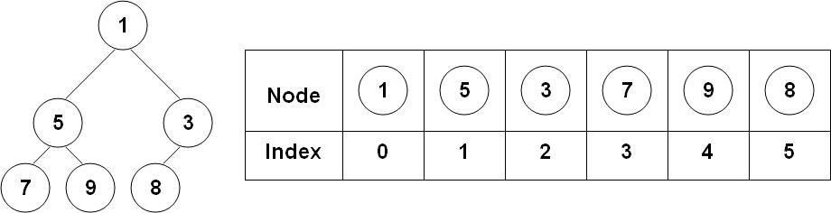

**Universidade Federal da Bahia - UFBA**<br>
**Instituto de Matemática - IM**<br>
**Departamento de Ciência da Computação - DCC**<br>
**Curso de Bacharelado em Ciência da Computação**<br>
**MATA40 - Estrutura de Dados | Período: 2019.2 | Data: 19/11/2019**<br>
**Prof. Antonio L. Apolinário Junior**

<h1 align="center">Laboratório 11 – Árvore Heap</h1>

**Objetivos:**

-   Compreender de forma prática o conceito de **Árvore Heap**.
-   Implementar, em linguagem C o TAD Árvore Heap.

**Conceitos básicos:**

Uma Árvore Heap é uma árvore binária, com algumas restrições adicionais:

1. É uma árvore completa, ou seja, todos os seus níveis são preenchidos, a exceção do último que pode ficar incompleto, porém possui todos os nós da esquerda para a direita preenchidos (Figura 1);
 <p align="center">
 	
 </p>
 <h5 align="center"><i>Figura 1 - Exemplo de um Max-Heap</i></h5>

2. Todos os nós de uma árvore Heap são maiores/menores que seus nós filhos, o que define que temos um Max-Heap/Min-Heap.
 <p align="center">
 	
 </p>
 <h5 align="center"><i>Figura 2 - Implementação de um Min-Heap na forma de um vetor</i></h5>

Por conta da propriedade 1. usualmente a árvore Heap é implementada sem estruturas apontadas apenas como um vetor, como ilustra o exemplo da Figura 2. Nesse roteiro utilizamos a seguinte estrutura de dados para implementar um **Heap**:

```c
typedef struct {
	int* heap;
	int numElem;
	int maxElem;
} tHeap;
```

**Roteiro:**

1. Baixe do _Moodle_ os códigos fonte base para esse Laboratório.

2. Analise a estrutura de arquivos que compõe esse Laboratório. Abra os arquivos e entenda onde está o programa principal e quais são os módulos utilizados.

3. Compile os programas executando na linha do console o comando **make**. Após compilar e verificar que nenhum erro foi gerado, execute o programa através do console usando o comando **./maxHeap**.

4. Codifique as funções **createHeap** e **clearHeap**, responsáveis pela inicialização e remoção da estrutura de dados vinculada ao Heap. Teste essas funções utilizando o programa **maxHeap**.
 <p align="center">
 	
 </p>
 <h5 align="center"><i>Figura 3</i></h5>

5. Análise as relações de posicionamento dos nós da árvore Heap (ilustrados na Figura 3) e estabeleça as expressões que, dado o índice de um nó, permitam calcular: 1) o índice de seu antecessor; e 2) os índices de seus descendentes.

6. De posse das expressões definidas no passo anterior, codifique a função **upHeap**, responsável por fazer com que um novo nó da árvore Heap “suba" na estrutura de dados, para restabelecer a condição ii. de uma árvore Heap.

7. Codifique a função **insertNode** para inserir um novo dado na sua árvore Heap. Teste sua função.

8. De posse das expressões definidas no passo 5), codifique a função **downHeap**, responsável por fazer com que um nó da árvore Heap “desça" na estrutura de dados, para restabelecer a condição ii. de uma árvore Heap.

9. Codifique a função **removeNode** e remover um dado da árvore Heap. Lembre-se de que as remoções são feitas apenas do elemento raiz da árvore.

10. Testados todos as operações básicas de uma árvore Heap, codifique um programa de teste que ordene um vetor utilizando o TAD **tHeap** que você acabou de criar. Para esse programa você deverá incluir no seu TAD duas novas funções:
    1. **createHeapFromVector**, que recebe como parâmetro o endereço de um vetor já pre-alocado externamente e seu tamanho;
    2. **heapSort**, que ordena o vetor associado a árvore Heap, ou seja, deve retornar o vetor originalmente fornecido a função i. com seus elementos todos ordenados.
