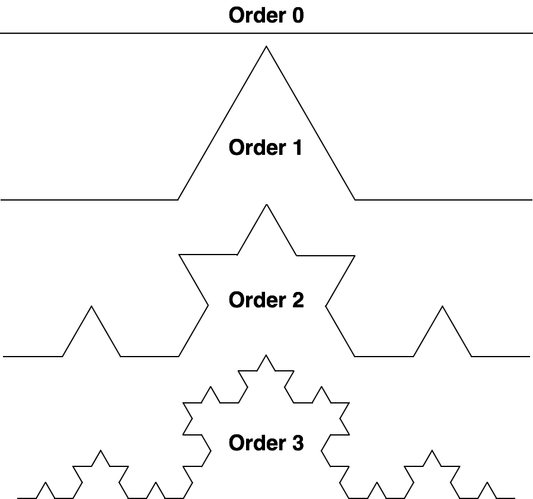

**Universidade Federal da Bahia - UFBA**<br>
**Instituto de Matemática - IM**<br>
**Departamento de Ciência da Computação - DCC**<br>
**Curso de Bacharelado em Ciência da Computação**<br>
**MATA40 - Estrutura de Dados | Período: 2019.2 | Data: 17/09/2019**<br>
**Prof. Antonio L. Apolinário Junior**

<h1 align="center">Roteiro do Laboratório 4 - Recursividade</h1>

**Objetivos:**

-   Compreender o conceito de Recursividade;
-   Reforçar os conceitos básicos de chamadas a funções em linguagem C;
-   Implementar, em linguagem C, programas que utilizam funções recursivas.

**Conceitos básicos:**

-   **Recursividade:**
    O conceito de recursividade em Ciência da Computação está fortemente ligado a estratégia de solução de problemas "dividir para conquistar". Nesse tipo de abordagem, a solução de um problema é definida pela solução de um ou mais problemas do mesmo tipo, mas sobre um conjunto de dados cada vez menor. Ao se alcançar um problema simples, cuja solução é conhecida de forma direta, o processo de redução é finalizado. As soluções dos problemas mais complexos são então construídas a partir da solução trivial, voltando-se aos problemas mais complexos. Matematicamente, tal conceito é dado por uma expressão como:

    ```
    F(n+1) = f(F(n))
    F(0) = a
    ```

    Em linguagem de programação C, temos:

    ```c
    void F(int n) {
    	if (n == 0) {
    		return a;
    	}
    	return F(n-1);
    }
    ```

**Roteiro:**

1. Baixe do _Moodle_ os códigos fontes desse Laboratório e descompacte os códigos fonte.

2. Analise o código de **recursaoClassicos.c**. Compile e execute esse codigo.

3. Codifique as duas funções de cálculo do **Fatorial** de um número, iterativa e recursiva. Rode o programa e compare os resultados.

4. Codifique as duas funções de cálculo da **Série de Fibonacci** de um número, iterativa e recursiva. Rode o programa e compare os resultados.

5. Para os 2 algoritmos, avalie o comportamento das funções iterativas e recursivas quando os valores dos seus argumentos crescem.

6. Verifique a função **imprimeVetor()**. Após sua análise faça uma versão recursiva dela: **imprimeVetorRecursivo()**. Teste e compare a execução das duas funções em relação ao tamanho dos vetores envolvidos.

7. Codifique a função **OrdenaVetor()** implementando um dos algoritmos de ordenação que você codificou na última aula teórica. Teste seu algoritmo se ele é capaz de ordenar o vetor.

8. Codifique a função **buscaBinariaRecursiva()** implementando o algoritmo de Busca Binária em sua forma recursiva. Teste seu algoritmo se ele é capaz de realizar as buscas no vetor de forma correta.

**Desafio:**
Considere a **_curva de Koch_** mostrada na figura abaixo. Esse fractal é bastante conhecido e é gerado pelo processo de refinamentos sucessivos. Dado um segmento de reta inicial, este é dividido em 3 partes iguais. O terço central é removido e substituído por 2 novos segmentos, de igual tamanho. A curva de ordem 1 tem portanto 4 segmentos. Aplicando-se o mesmo processo de refinamento em cada um desses 4 segmentos chegamos a curva de ordem 2. Seguindo o processo a curva gerada no limite é a **_curva de Koch_**. Essa curva é conhecida também como _snowflake_ ou floco de neve.

<p align="center">
    
</p>

Implemente um programa que possua uma função recursiva **geraCurvaDeKoch()**, que recebe os pontos inicial e final do primeiro segmento e gera a sequência de pontos (e armazena em um vetor) que representa a **_Curva de Koch_** de ordem definida pelo parâmetro **level**. Use a estrutura de dados especificada no arquivo **ponto.h**.

**Desafio Supremo:**
O programa **curvaKoch.c** é capaz de desenhar uma linha em uma janela. Adapte sua função que você criou no Desafio anterior para que a curva seja desenhada por esse programa. Repare que ele faz uso de um módulo **winGL.\***. Você não precisa alterar em nada esse módulo. Pense nele como uma caixa preta.
