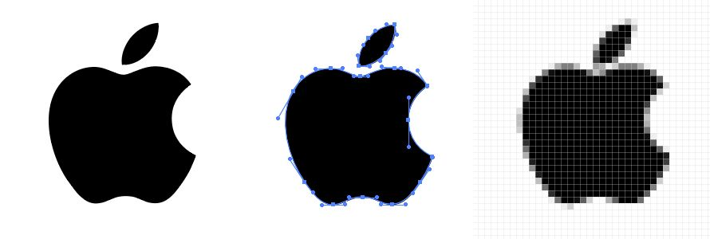
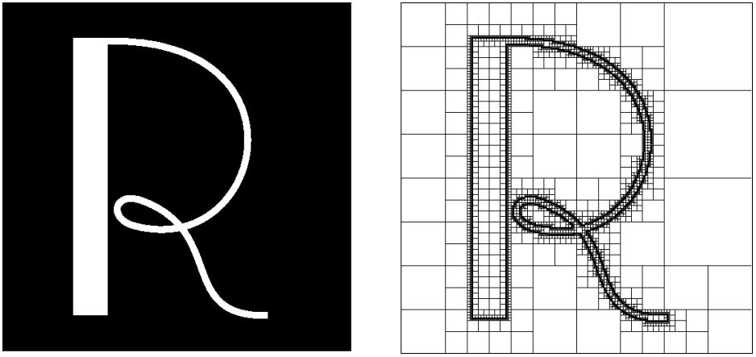
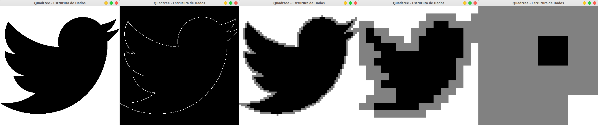

**Universidade Federal da Bahia - UFBA** 
**Instituto de Matemática - IM** 
**Departamento de Ciência da Computação - DCC** 
**Curso de Bacharelado em Ciência da Computação** 
**MATA40 - Estrutura de Dados | Período: 2019.2 | Data: 19/11/2019** 
**Prof. Antonio L. Apolinário Junior**

<h1 align="center"><i>Segundo Trabalho - Vetorização de Imagens</i></h1>

**Motivação:**

Um problema bastante comum nas representações gráficas é a conversão da representação matricial, composta por pixels, para uma representação vetorial, representada por pontos e linhas. Na figura 1 vemos um exemplo dessas duas representações.

Considerando uma imagem em preto e branco como a da Figura 1, um algoritmo bem simples para proceder essa conversão é encontrar a fronteira entre o objeto e a cor de fundo. Uma vez identificados esses pixels é possível conectá-los e gerar uma versão vetorial da imagem.

    

<h5 align="center"><i>Figura 1 - Processo de vetorização: à direita uma imagem matricial (de baixa resolução) e à esquerda uma
representação vetorial (também de baixa resolução) sobreposta a imagem original do logotipo da Apple.</i></h5>

Uma busca exaustiva por todos os pixels não é interessante. Para acelerar o processo podemos imaginar um processo que procura por agrupamentos de pixels semelhantes. Essa representação pode ser vista na Figura 2 à direita.

    

<h5 align="center"><i>Figura 2 - Estrutura de subdivisão do espaço para a localização da fronteira do objeto de primeiro plano.</i></h5>

**Objetivos do Problema:**

O objetivo principal do trabalho é aplicar os conceitos de **Tipo Abstrato de Dado (TAD Hierárquico**, ou seja, **Árvore** <a href="#1">[1]</a> <a href="#2">[2]</a> <a href="#3">[3]</a> apresentados em sala de aula, no contexto de um problema real e prático.

A implementação do ​**TAD** deverá ser integrada ao problema e uma solução computacional codificada em linguagem C.

**O Problema:**

Considerando a motivação apresentada, seu trabalho será, baseado no código fonte base fornecido pelo professor, implementar um programa que construa uma estrutura hierárquica associada a uma imagem (em preto e branco) com o propósito de vetoriza-la.

A imagem é armazenada na aplicação pela variável **image** como uma matriz de bytes (**unsigned char**​ alocada dinamicamente pela rotina de leitura. Sua dimensão é armazenada por duas variáveis inteiras **iHeight** e **iWidth**. Todas essas variáveis são globais.

O programa base fornecido pelo professor já inicia mostrando a imagem original, como no exemplo da Figura 3 (a). O programa deve então gerar uma estrutura que represente os pixel do contorno do objeto (vamos considerar sempre fundo branco e objeto em preto). Deve ser possível visualizar o resultado de duas formas:

-   Os pixels do contorno enfatizados sobre um fundo preto (Figura 3(b));
-   As representações em resoluções intermediárias, onde as regiões externas aparecem em branco, regiões internas em preto e as regiões candidatas a conter a fronteira do objeto em cinza. Essas visualizações aparecem nas imagens da Figura 3<spam>(c)</spam>(d)(e).

	

(a) (b) (c) (d) (e)

<h5 align="center"><i>Figura 3 - Visualizações suportadas pelo seu programa: (a) imagem original, (b) destaque dos pixels classificados como fronteira, (c) (d) (e) visualização de regiões intermediárias e suas classificações em resoluções cada vez menores.</i></h5>

**A Implementação:**

A implementação deve ser feita em linguagem C ANSI (independente de qualquer IDE ou SO)<a href="#ftnt01">1</a> e tomar por base o código fonte base fornecido pelo professor. Esse código fonte está divido em alguns módulos, a saber:

-   **winGL.\***<a href="#ftnt02">2</a> Rotinas responsáveis pelo controle das janelas e dos desenhos;

-   Diretorio **external** <a href="#4">[4]</a> <a href="#ftnt03">3</a> Contem a biblioteca SOIL responsável pela leitura de uma imagem, em diversos formatos;

-   **vetoriza.\*** Programa principal e rotinas de tratamento de eventos de teclado, _mouse_ e desenho.

-   Diretório **IMGs** Banco de imagens que você deve utilizar para rodar seu programa.

Os trabalhos deverão ser desenvolvidos individualmente. O código fonte gerado deve ser comentado e legível. Acompanhando o código fonte um breve relatório técnico (README.txt) deve ser produzido, descrevendo o uso do programa.

**A Entrega:**

O trabalho deverá ser submetido via _Moodle_ , respeitando a data e hora limite para entrega. Em caso de atraso, será aplicado um fator de penalização de 1,0 ponto por dia de atraso.

Os códigos fonte devem ser enviados seguindo o padrão: arquivo compactado (.zip, .rar ou .tgz apenas) contendo um diretório com o nome do(s) aluno(s) e seu arquivos. **Arquivos fora desse padrão sofrerão penalização de 0,5 ponto na nota final**.

Códigos com erros de compilação ou qualquer outra pendência que impeça a compilação não serão avaliados. Da mesma forma, arquivos compactados corrompidos não serão considerados.

Uma aula será destinada a apresentação dos trabalhos, onde cada aluno mostrará ao professor o que foi feito.

A cooperação entre alunos e grupos é considerada salutar. No entanto, trabalhos com alto grau de similaridade serão tratados como “plágio”, o que resultará em avaliação **_zero_ para todos os envolvidos**.

Qualquer dúvida adicional, evite problemas: não presuma nada, procure o professor para esclarecimentos.

**Referencias Bibliográficas**:

-   <spam id="1">[1]</spam> Ziviani, Nivio. **Projeto de Algoritmos: com Implementações em Pascal e C**. Vol. 2. Thomson, 2004.
-   <spam id="2">[2]</spam> Cormen, T. H., Leiserson, C. E., Rivest, R. L., & Stein, C. **Introdução a algoritmos**. 2001.
-   <spam id="3">[3]</spam> Sedgewick, Robert. **Algorithms in C++**. Pearson Education, 2003.
-   <spam id="4">[4]</spam> **Simple OpenGL Image Library**, disponível em: http://www.lonesock.net/soil.html
-   <spam id="5">[5]</spam> Marco Antonio G. Carvalho, **Instalação da biblioteca OpenGL no Dev-C++** ​, 2006, disponível em: http://www.ft.unicamp.br/~magic/opengl/instala-windows.html
-   <spam id="6">[6]</spam> **Instalar glut no CodeBlocks** , 2012, disponível em: [http://opengl-ms.blogspot.com.br/2012/08/instalar-glut-no-codeblocks.html](http://opengl-ms.blogspot.com.br/2012/08/instalar-glut-no-codeblocks.html)
-   <spam id="7">[7]</spam> **How to Install OpenGL on Ubuntu Linux**, 03/2018, disponível em: [http://www.codebind.com/linux-tutorials/install-opengl-ubuntu-linux/](http://www.codebind.com/linux-tutorials/install-opengl-ubuntu-linux/)

---

1 ou seja, não pode fazer uso de bibliotecas ou chamadas a rotinas ligadas a nehum SO. 
2 Para utilizar as rotinas gráficas você precisa das bibliotecas OpenGL [6] e GLUT[5] instaladas em seu computador. Siga as instruções das referências [6] e [5] para instalação no ambiente Windows. Para Linux utilize o seu gerenciador de pacotes preferido e baixe os pacotes de desenvolvimento dessas libs. Qualquer dúvida solicite auxilio ao professor. 
3 A biblioteca deve ser gerada de acordo com o procedimento descrito no arquivo **README.md**.
